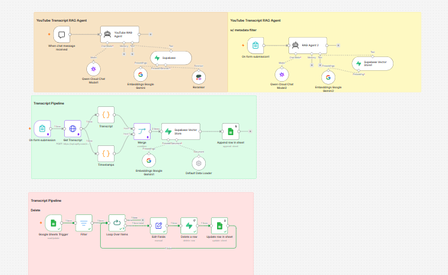

# 🎥 YouTube RAG — AI-Powered Video Knowledge Base

An end-to-end **Retrieval-Augmented Generation (RAG)** system built with **n8n** that transforms YouTube video transcripts into a searchable AI knowledge base.

The system automatically extracts transcripts, processes timestamp-aware chunks, generates vector embeddings, stores them in **Supabase**, and enables AI-powered question answering through both **general retrieval** and **video-specific metadata filtering**.

It also includes a controlled **data deletion pipeline** that allows indexed videos to be removed from the vector database through Google Sheets.

---

## ✨ Features

- 🎬 Automated YouTube transcript extraction
- 🧩 Transcript processing and intelligent chunking
- ⏱️ Timestamp-aware transcript chunks
- 🧠 Google Gemini embeddings
- 🗄️ Supabase vector storage
- 🔎 Semantic similarity search
- 🎯 Cohere reranking
- 💬 Conversational YouTube RAG Agent
- 🏷️ Metadata-filtered retrieval
- 🔗 Source attribution with timestamps and URLs
- 📊 Google Sheets knowledge-base management
- 🗑️ Controlled transcript deletion
- 🔄 End-to-end n8n automation
- 🔐 Credential-safe public workflow export

---

# 🏗️ System Architecture

The workflow is organized into four main pipelines:

1. **Transcript Ingestion & Storage**
2. **General YouTube RAG Agent**
3. **Metadata-Filtered RAG Agent**
4. **Transcript Deletion & Cleanup**

## Complete Workflow



The complete workflow connects transcript extraction, processing, embeddings, vector storage, retrieval, metadata filtering, reranking, and controlled deletion.

📖 **Detailed technical architecture:**  
[Documentation → System Architecture](Documentation/architecture.md)

---

## 🔄 1. Transcript Ingestion & Storage

The ingestion pipeline transforms a YouTube video into structured, searchable knowledge.

## Workflow

```text
YouTube Video
      │
      ▼
On Form Submission
(Video Title + URL)
      │
      ▼
Get Transcript
      │
      ├──────────────► Transcript
      │
      └──────────────► Timestamps
                            │
                            ▼
                          Merge
                            │
                            ▼
                   Default Data Loader
                            │
                            ▼
                    Gemini Embeddings
                            │
                            ▼
                   Supabase Vector Store
                            │
                            ▼
                    Google Sheets

##How It Works
1. Video Submission

The user provides:

Video Title
YouTube URL

through an n8n Form Trigger.

##2. Transcript Extraction

The YouTube URL is sent to an Apify transcript scraper.

The scraper returns timestamped transcript segments containing:

Transcript text
Start time
Duration

##3. Transcript Processing

The workflow processes the transcript through dedicated n8n Code nodes.

The transcript is normalized and grouped into timestamp-aware chunks.

Each chunk preserves:

Combined transcript text
Start timestamp
End timestamp
Duration
Chunk number

##4. Metadata Enrichment

Each stored document contains metadata including:

videoTitle
timestamp
videoURL

This metadata enables source attribution and video-specific retrieval.

##5. Vectorization

Google Gemini converts transcript chunks into vector embeddings.

Transcript Chunk
      │
      ▼
Gemini Embedding Model
      │
      ▼
Vector Representation

##6. Storage

The generated embeddings and metadata are stored in the Supabase documents table.

Google Sheets maintains a lightweight index of processed videos.

Ingestion Pipeline Screenshot

##🧠 2. General YouTube RAG Agent

The general RAG pipeline allows users to query the entire indexed YouTube knowledge base.

Workflow

User Query
    │
    ▼
YouTube RAG Agent
    │
    ├──────────────► Qwen Cloud
    │
    └──────────────► Supabase Vector Search
                            │
                            ▼
                         Retrieval
                            │
                            ▼
                     Cohere Reranker
                            │
                            ▼
                  Relevant Transcript Chunks
                            │
                            ▼
                      Grounded Response


The agent retrieves relevant transcript chunks from Supabase and uses Cohere reranking to improve retrieval relevance.

The final response is generated using the Qwen chat model.

The agent is designed to ground responses in retrieved transcript content and preserve source metadata.

RAG Agent Screenshot

##🎯 3. Metadata-Filtered RAG Agent

The metadata-filtered pipeline is designed for questions about a specific YouTube video.

Workflow

Video Insights Form
(Video Title + Query)
        │
        ▼
    RAG Agent 2
        │
        ├──────────────► Qwen Cloud
        │
        └──────────────► Supabase Vector Store
                                │
                                ▼
                       Metadata Filter
                       videoTitle = selected
                                │
                                ▼
                       Relevant Chunks
                                │
                                ▼
                          AI Response

##Why Metadata Filtering?

When multiple videos contain similar topics or terminology, unrestricted retrieval can introduce context from unrelated videos.

The metadata filter restricts retrieval to documents belonging to the selected video.

All Documents
      │
      ▼
Filter by videoTitle
      │
      ▼
Selected Video Documents
      │
      ▼
Semantic Retrieval
      │
      ▼
Relevant Context

This provides more precise video-specific answers and reduces cross-video context mixing.

Metadata Filter Screenshot

##🗑️ 4. Transcript Deletion & Cleanup

The deletion pipeline provides lifecycle management for indexed transcripts.

Workflow

Google Sheets
      │
      │ Status = "Remove"
      ▼
Google Sheets Trigger
      │
      ▼
Filter
      │
      ▼
Loop Over Items
      │
      ▼
Edit Fields
      │
      ▼
Delete Matching Supabase Vectors
      │
      ▼
Update Google Sheets
      │
      ▼
Status = "Removed"


The video URL is used to identify the transcript documents stored in Supabase.

After deletion, the spreadsheet status is updated from:

Remove

to:

Removed
Delete Pipeline Screenshot

##🔁 Data Lifecycle

The complete lifecycle of an indexed YouTube video is:

YouTube URL
     │
     ▼
Transcript Extraction
     │
     ▼
Transcript Processing
     │
     ▼
Chunking + Timestamps
     │
     ▼
Metadata Enrichment
     │
     ▼
Gemini Embeddings
     │
     ▼
Supabase Vector Store
     │
     ├──────────────► General RAG
     │
     └──────────────► Metadata-Filtered RAG
     
     
Google Sheets
     │
     │ Status = Remove
     ▼
Vector Deletion
     │
     ▼
Status = Removed

##🧰 Technology Stack
Layer	Technology
Workflow Automation	n8n
Transcript Extraction	Apify
LLM	Qwen Cloud — qwen3.7-flash
Embeddings	Google Gemini
Vector Database	Supabase + pgvector
Reranking	Cohere
Knowledge Base Management	Google Sheets
Data Processing	JavaScript / n8n Code Nodes
Architecture	Retrieval-Augmented Generation (RAG)

##📁 Project Structure
youtube-rag-n8n/
│
├── Workflow/
│   └── youtube-rag-n8n.json
│
├── Screenshots/
│   ├── workflow-overview.png
│   ├── transcript-pipeline.png
│   ├── rag-agent.png
│   ├── metadata-filter-rag.png
│   └── delete-pipeline.png
│
├── Documentation/
│   └── architecture.md
│
├── README.md
├── .gitignore
└── .env.example

##⚙️ Setup & Installation
Prerequisites

Before importing the workflow, make sure you have:

An active n8n instance
A Supabase project with pgvector enabled
An Apify account and API token
Google Gemini API access
Google Sheets OAuth credentials
Qwen Cloud API access
Cohere API access
#1. Import the Workflow

Import:

Workflow/youtube-rag-n8n.json

into your n8n instance.

#2. Configure Credentials

Configure the required n8n credentials for:

Apify
Supabase
Google Sheets
Google Gemini
Qwen Cloud
Cohere
#3. Configure Supabase

Create and configure the required documents table with vector support.

The vector store is used to store:

Transcript content
Embeddings
Video metadata
Timestamp information
#4. Configure Google Sheets

Create a tracking sheet with:

Title	URL	Status	Transcript

The Status column is used by the deletion pipeline.

##🔐 Security

The published workflow is sanitized for public sharing.

No API keys or access tokens are included.
Sensitive configuration values are replaced with placeholders.
Google Sheet IDs and API tokens use placeholders.
.gitignore excludes local environment and credential files.
Credentials must be configured separately inside your own n8n instance.

⚠️ Never commit API keys, access tokens, passwords, OAuth secrets, or service-account credentials to the repository.

##🧠 Design Principles
Grounded Generation

RAG agents are instructed to rely on retrieved transcript content and avoid unsupported claims.

Source Traceability

Transcript chunks retain video title, timestamp, and URL metadata so generated answers can be traced back to the original source.

Metadata-Aware Retrieval

The system can restrict retrieval to a specific video when precise video-level querying is required.

Retrieval Quality

The general RAG pipeline uses reranking to improve the relevance of retrieved transcript chunks.

Data Lifecycle Management

Indexed videos can be removed from the vector database through a controlled Google Sheets workflow.

Modular Architecture

Each major responsibility is isolated into a dedicated workflow section, making the system easier to understand, maintain, and extend.

##🎬 Demo

A complete demonstration of the YouTube RAG workflow is included in the project presentation.

The demo covers:

Transcript ingestion
Transcript processing
Vector storage
General RAG querying
Metadata-filtered querying
Transcript deletion

##👨‍💻 Author

Ahmed Gabr Elzanbeel

AI Automation & Integration Engineer

Specializing in:

AI Agents
RAG Systems
n8n Workflow Automation
API & Workflow Integrations
AI Automation
⭐ Support

If you find this project useful, consider giving the repository a ⭐ on GitHub.
